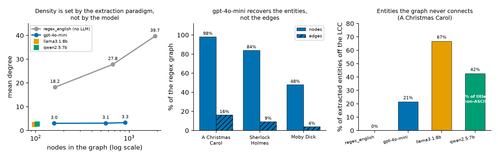

# graphrag-extractor-effects

**Graph density in Microsoft GraphRAG is set by the extraction paradigm,
not by the model. Paying for a better LLM buys you entities, not edges.**

GraphRAG turns a corpus into an entity graph, partitions that graph, and
summarizes the partitions. Everything downstream depends on the graph. But
the graph is not a property of the corpus: it is a property of the corpus
*and* whatever extracted the entities.

This repository holds three corpora through the same GraphRAG pipeline,
the same chunker and the same clusterer, changing only the extractor. Four
extractors, from a regex with no LLM at all up to gpt-4o-mini.

## The result

Mean degree, across corpora spanning 161 to 1,888 nodes. From
`results/extraction_models.csv`:

| Extractor | A Christmas Carol | Sherlock Holmes | Moby Dick |
|---|---|---|---|
| `regex_english` (no LLM) | 18.2 | 27.8 | **39.7** |
| gpt-4o-mini (paid API) | 3.01 | 3.09 | **3.30** |
| llama3.1:8b (local) | 2.58 | | |
| qwen2.5:7b (local) | 2.79 | | |

**Every LLM extractor lands near mean degree 3 and stays there.** A 7B
model run locally and a production gpt-4o-mini differ by less than one
edge per node, and neither moves as the corpus grows fourteen-fold. The
regex path starts at 18 and climbs to 40 over the same range. Density is a
property of what the extraction step is *asked to emit*, not of how good
the model is at emitting it: `extract_graph_nlp` links noun phrases that
co-occur, so it grows denser as a corpus gives entities more chances to
appear together, while LLM extraction emits only relations a model states
explicitly, and that count stays roughly proportional to the number of
entities.



## What a better model does buy

Model quality is not irrelevant. It moves entity recall, and it moves
entity *resolution*. It just does not move density.

| | llama3.1:8b | qwen2.5:7b | gpt-4o-mini |
|---|---|---|---|
| nodes, as % of the regex graph | 60% | 65% | **98%** |
| entities left off the largest component | 67% | 43% | **21%** |
| non-ASCII entity titles | 0% | **8.3%** | 0% |
| distinct entity types | 14 | 11 | 5 |

On A Christmas Carol gpt-4o-mini finds 158 of the 161 entities the regex
path finds, against llama3.1's 97, and leaves 21% of what it extracted off
the main component against llama3.1's 67%. That is a large, real
improvement. It comes with 238 edges against the regex path's 1,466.

**qwen2.5 translated the entity names.** It emitted Chinese renderings of
English proper nouns alongside untranslated ones, and a type vocabulary
mixing Chinese and English labels. 8.3% of its entity titles contain
non-ASCII letters. The translated and untranslated forms of one entity
become two nodes, so entity resolution fails silently: nothing errors, the
pipeline completes, and the graph is wrong. The `nonascii_title_frac`
column exists to catch exactly this. gpt-4o-mini shows 0% on A Christmas
Carol and 0.3% on the two larger corpora.

## The gap widens with corpus size

Because the regex graph densifies with n and the LLM graph does not, the
two diverge as corpora grow. gpt-4o-mini against `regex_english`:

| Corpus | nodes recovered | edges recovered | mean-degree ratio |
|---|---|---|---|
| A Christmas Carol | 98% | 16% | 6.0x |
| Sherlock Holmes | 84% | 9% | 9.0x |
| Moby Dick | 48% | 4% | 12.0x |

A conclusion drawn on one of these graphs does not transfer to the other,
and the size of the discrepancy depends on how large your corpus is.

## Why this matters

If you read a result reported on "the GraphRAG entity graph" for some
corpus, you cannot reconstruct the object it was measured on. Papers do
generally name the extraction model. What they do not report is the
resulting graph's structural statistics, and the tables above are the
reason that matters: two reasonable extractor choices give graphs that
differ by 12x in mean degree on the same text.

The practical recommendation is one line long. **Report n, m, mean degree
and the fraction of extracted entities off the largest connected component
alongside any result computed on an LLM-built knowledge graph.** All four
are free to compute and they pin down the object. A fifth, the fraction of
entity titles that are non-ASCII, costs nothing and catches a silent
entity-resolution failure that a 7B model produced here on its first
attempt.

## Reproducing this

```bash
python3 -m venv .venv && ./.venv/bin/pip install -r requirements.txt

# Build one GraphRAG workspace per corpus, per extraction mode.
./.venv/bin/python setup_index.py --mode nlp

# The no-LLM path needs no API key and costs nothing.
GRAPHRAG_API_KEY=unused ./.venv/bin/python -m graphrag index \
    --root idx/christmas_carol_nlp --skip-validation

# Record the shape of every index that exists, then plot.
./.venv/bin/python exp_extraction_models.py
./.venv/bin/python make_fig.py
```

The paid arm indexes all three corpora with gpt-4o-mini. Estimate the
spend first with `cost_model.py`; the run below took about 16 minutes:

```bash
./.venv/bin/python setup_index.py --mode llm
export GRAPHRAG_API_KEY=sk-...
for c in christmas_carol sherlock_holmes moby_dick; do
    ./.venv/bin/python -m graphrag index --root idx/${c}_llm --skip-validation
done
```

The local arms use Ollama, which exposes an OpenAI-compatible API, so they
run at zero cost:

```bash
ollama pull llama3.1:8b
./.venv/bin/python setup_index.py --mode local
```

One practical note. `max_gleanings` is a follow-up round that tells the
model it missed entities. GraphRAG's default is 1, and both gpt-4o-mini
and llama3.1 tolerate it, but qwen2.5:7b stalled for more than 20 minutes
generating on a single chunk, so `setup_index.py` allows it to be set to 0
for small local models. Gleanings are also roughly half the LLM calls, so
the setting matters for cost as well as recall.

## Cost

`cost_model.py` estimates GraphRAG indexing spend before you commit to it,
reading chunk size, overlap and `max_gleanings` from graphrag's own
installed defaults so the estimate tracks the version you have. Prompt and
output sizes per chunk are stated ASSUMPTIONS, marked as such in the
source, because they depend on the corpus.

```bash
./.venv/bin/python cost_model.py --corpus-tokens 250000 --model gpt-4o-mini
```

For the three corpora here (482,251 tokens total, 438 chunks) it estimates
$0.71 on gpt-4o-mini for extraction. That is a model, not a measurement.
Check your provider's usage dashboard for what a run actually cost.

## Verification

```bash
./.venv/bin/python verify_numbers.py
```

Every number in this README is checked against `results/*.csv` by that
script, which names the file, row and column each must come from. Derived
figures such as the 12.0x mean-degree ratio read **both** operands from the
CSV rather than hand-typing either, since a gate that types its own
operands proves nothing. It exits non-zero on any mismatch.

## Limitations

- **Three corpora, one genre, one language.** All three are 19th-century
  English literary prose from Project Gutenberg. Nothing here establishes
  that the same spread appears on news, code, clinical notes or
  multilingual text, and the qwen2.5 translation failure in particular may
  behave differently on a corpus that is not entirely English.
- **The four-way comparison exists on one corpus.** Only A Christmas Carol
  was indexed by all four extractors. The local models were not run on the
  two larger corpora, so the claim that they sit in the same density band
  as gpt-4o-mini rests on a single point each.
- **One run per cell.** LLM extraction is not deterministic across runs and
  no arm is repeated here, so run-to-run variance is unmeasured. The gaps
  reported above are far larger than any plausible variation, but "far
  larger" is a judgment, not a measurement.
- **`max_gleanings` differs across arms.** It is 1 for gpt-4o-mini and
  llama3.1 and 0 for qwen2.5, for the stalling reason above. Gleanings
  raise recall, so qwen2.5's entity count is not strictly comparable to the
  other two LLM arms. It does not affect the density finding, which holds
  across both settings.
- **This is descriptive.** It reports what the extractors produce. It does
  not evaluate answer quality, retrieval, or which graph is better for any
  downstream task, and nothing here says the dense co-occurrence graph is
  preferable to the sparse assertion graph. They are different objects and
  the right one depends on the question being asked.

## Layout

| Path | Contents |
|---|---|
| `setup_index.py` | Builds one GraphRAG workspace per corpus per extraction mode |
| `gr_adapter.py` | GraphRAG parquet output to an edge list; largest component, simple, self-loop free |
| `exp_extraction_models.py` | Records the shape of every index that exists; writes the CSV |
| `cost_model.py` | Pre-spend indexing cost estimate, read from graphrag's own defaults |
| `make_fig.py` | Regenerates the figure from the CSV and nothing else |
| `verify_numbers.py` | Gate: checks every number in this README against the CSVs |
| `corpora/` | Public-domain source texts (Project Gutenberg, boilerplate stripped) |
| `results/extraction_models.csv` | Every number this repository reports |

## License

MIT, see `LICENSE`. The corpora are public domain via Project Gutenberg.
